# magento2-address
Make city and township as dropdown for Magento 2

# Screenshots

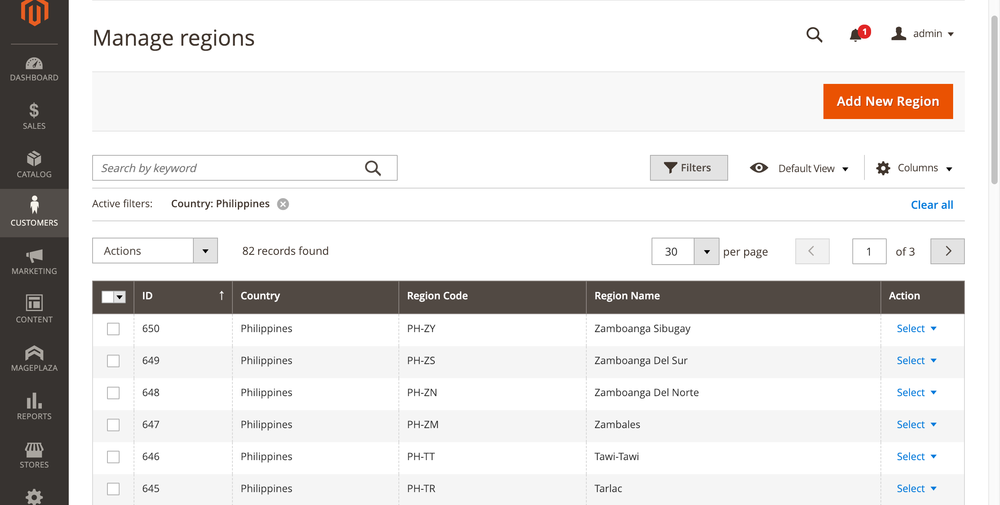
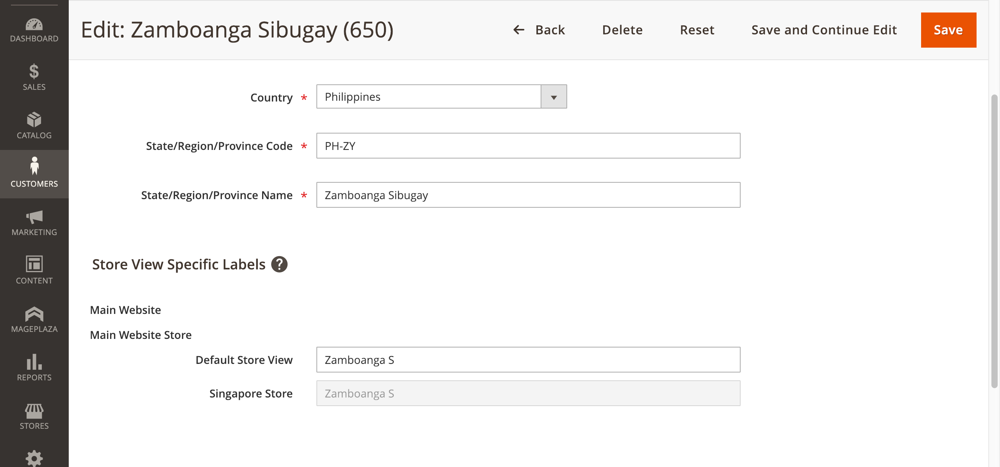
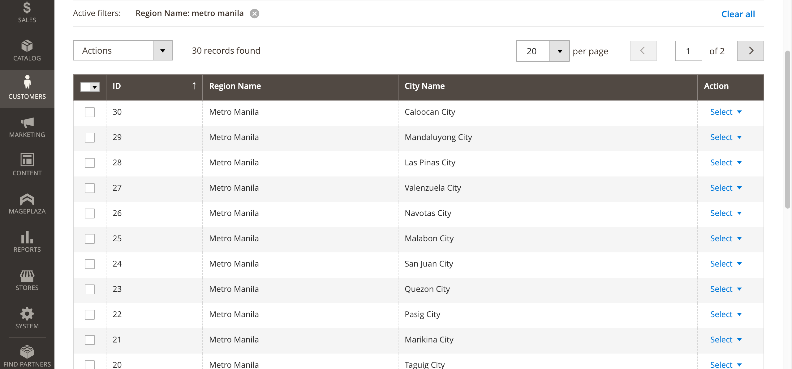
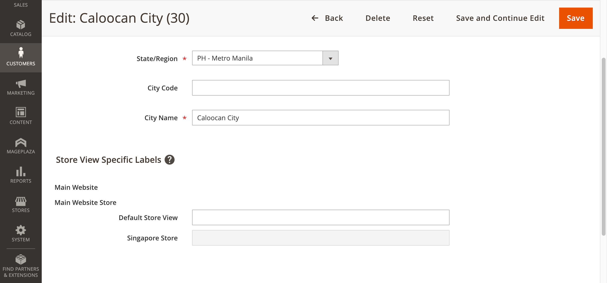
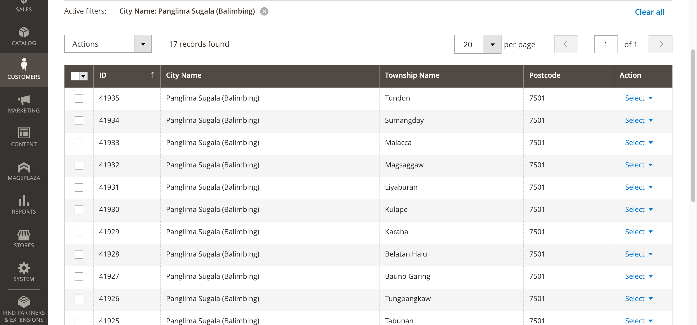
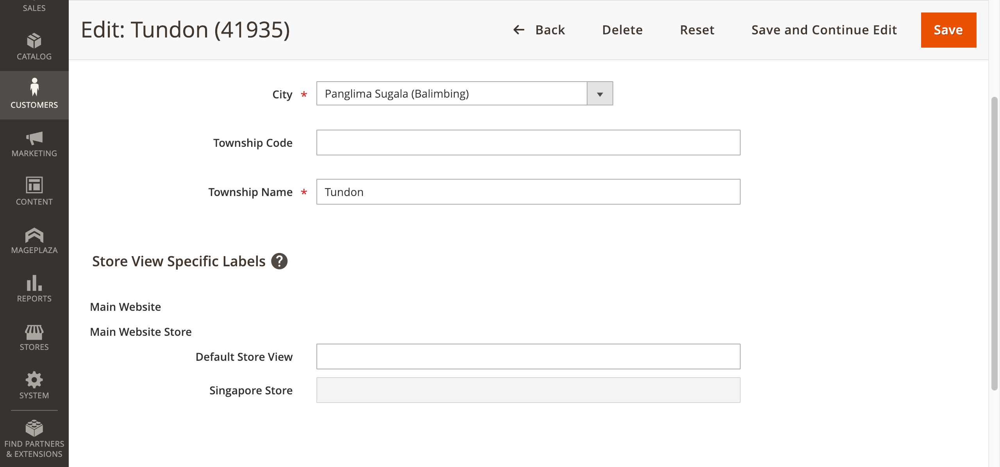
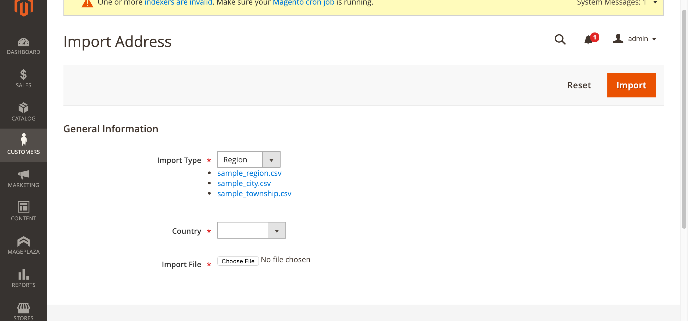
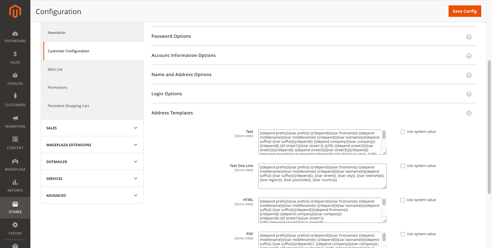
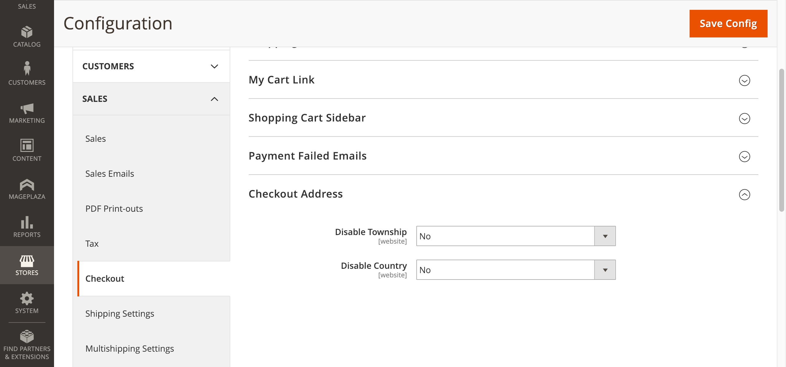
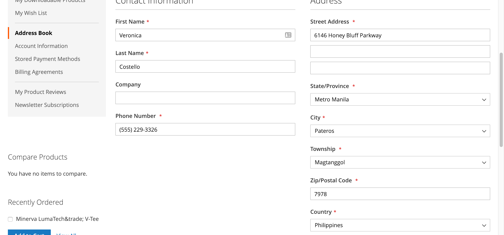
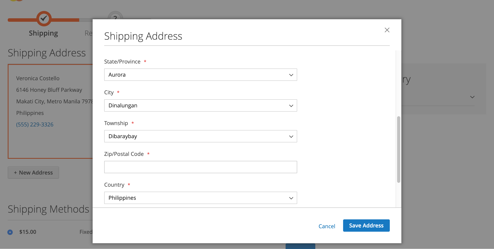
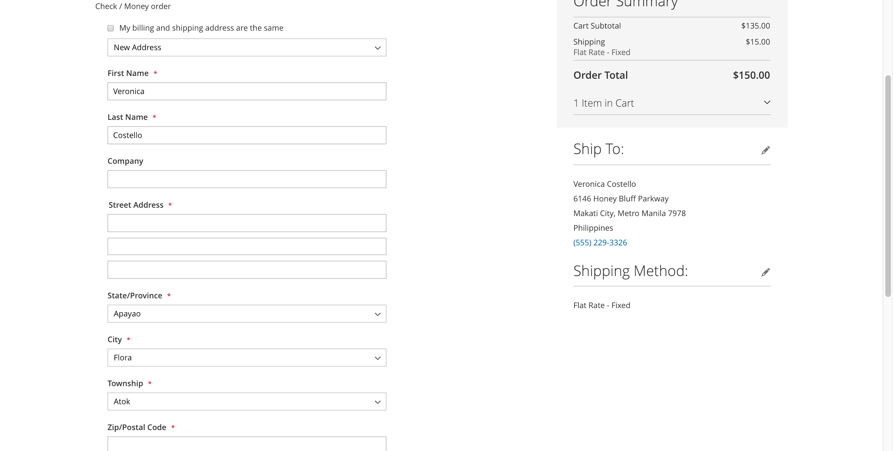

[Demo](http://demo.ebscommerce.asia/){:target="_blank"}

Please do not hesitate to contact me if you need more information
Skype: victornguyen20

###
Please buy it if you enjoy my extension.

